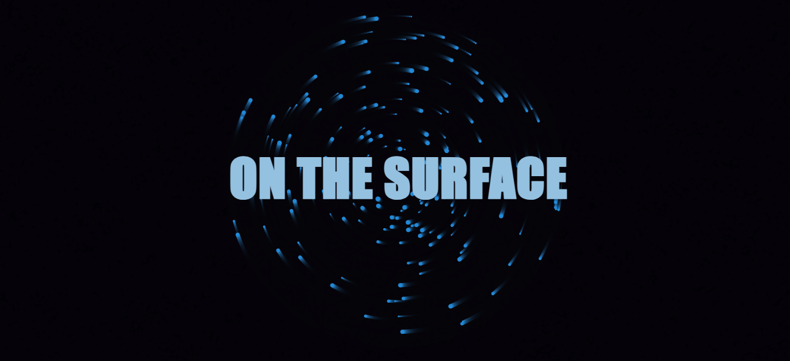

# ⚡ ENEMY — Audio-Reactive Web Engine


An experimental browser-based audio-reactive engine that synchronizes animated typography, particle systems and visual effects with music in real time.

Built as a personal programming project while learning JavaScript, HTML5 Canvas and modern web animation techniques.

---

## ✨ Features

- 🎵 Real-time lyric synchronization
- ⚡ Audio-reactive particle engine
- 💥 Multiple visual modes
  - INTRO
  - GLITCH
  - BERSERKER
  - KINETIC
  - CRITICAL
  - FLASH
- 🧠 Binary Search timeline system
- 🎬 GSAP powered transitions
- 🌌 HTML5 Canvas rendering
- 🎧 Web Audio API integration
- 📱 Responsive fullscreen experience

---

## 📸 Preview



---

## 🛠 Technologies

- HTML5
- CSS3
- JavaScript (ES6)
- HTML5 Canvas
- GSAP
- Web Audio API

---

## 📂 Project Structure

```
audio/
    Enemy.mp3

index.html

script.js

README.md
```

---

## 🚀 Running the project

Clone the repository

```bash
git clone https://github.com/USERNAME/enemy-audio-reactive-engine.git
```

Open the project

```
enemy-audio-reactive-engine
```

Launch a local server.

Examples:

VSCode Live Server

or

Python

```bash
python -m http.server
```

Then open

```
http://localhost:8000
```

Click

```
START EXPERIENCE
```

and enjoy.

---

## ⚠ Requirements

Modern browser

Recommended:

- Chrome
- Edge
- Firefox

JavaScript enabled

Audio autoplay must be allowed after clicking the start button.

---

## 🎨 Visual System

The engine changes its visual behavior depending on the current section of the song.

| Mode | Description |
|-------|-------------|
| INTRO | Calm orbital particles |
| GLITCH | Digital distortion |
| BERSERKER | Aggressive particle movement |
| KINETIC | Dynamic transitions |
| CRITICAL | Maximum intensity |
| FLASH | White flash ending |

---

## 🧠 How it works

The engine uses a manually synchronized timeline.

Every lyric line contains:

- start timestamp
- end timestamp
- visual style

During playback the engine performs a Binary Search over the timeline to determine the active lyric, allowing efficient rendering even with large timelines.

Audio intensity is obtained through the Web Audio API and influences the particle engine in real time.

---

## 📚 Learning Goals

This project was created to practice

- JavaScript
- Canvas rendering
- Animation systems
- Audio synchronization
- UI transitions
- Programming architecture

---

## ⚠ Music

This repository is intended as a programming showcase.

The included music belongs to its respective copyright holders.

If requested by the copyright owners, it will be removed.

---

## 👨‍💻 Author

RGS Labs™

GameJolt
[https://gamejolt.com/@RGS_Labs]

YouTube
[https://www.youtube.com/@RGS_Labs]

Website
[https://rabbitgamesdev.github.io/RGS-Labs/]

---

## ⭐ Support

If you enjoyed this project, consider giving it a star.

It helps a lot.
